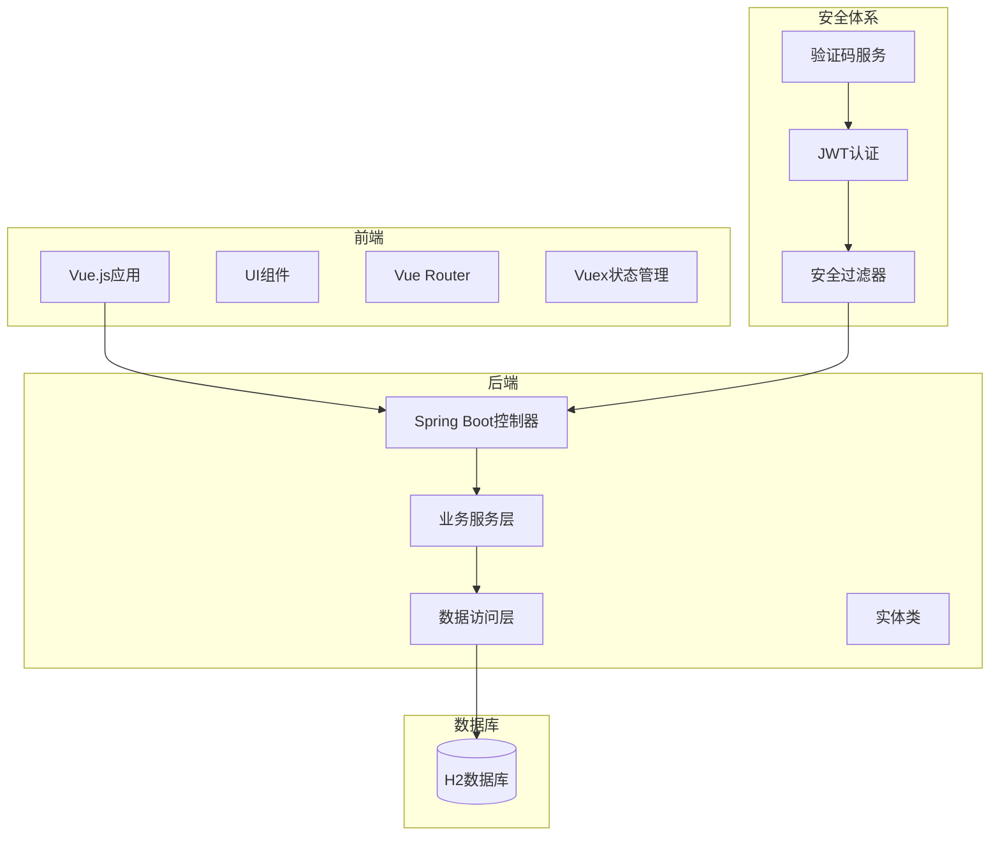
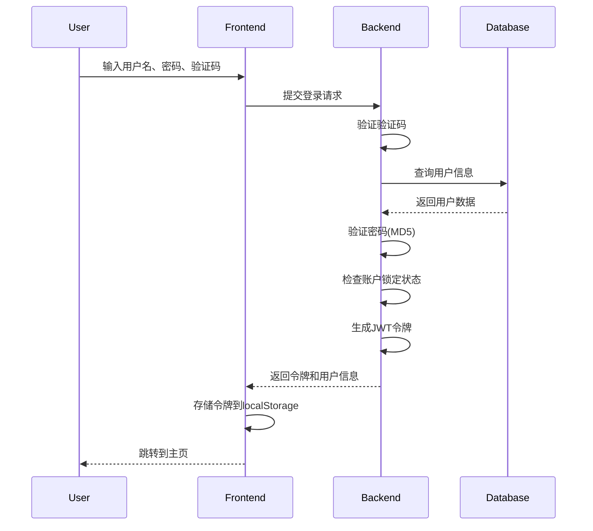
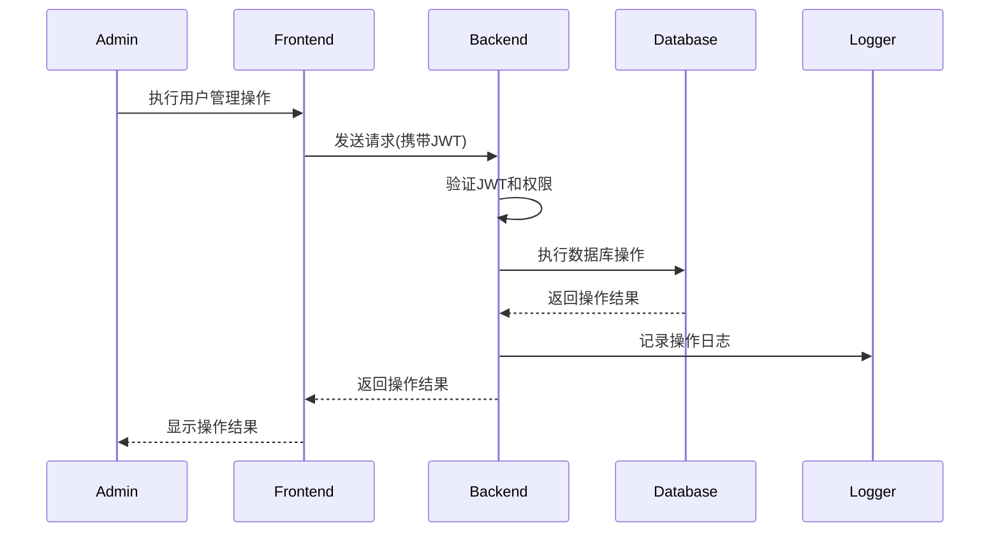

# 个人信息管理系统（PIM）概要设计文档

## 版本信息
- **版本号**: 1.0.0
- **最后更新**: 2025-09-10
- **作者**: 开发团队

## 设计决策说明
1. 采用前后端分离架构，提高系统灵活性和可维护性
2. 使用JWT进行身份认证，实现无状态服务
3. 引入验证码机制防止暴力破解
4. 实现管理员操作日志，满足安全审计需求
5. 采用MD5加密存储密码（注：建议未来升级为更安全的加密方式）

## 1. 系统架构

## 2. 模块划分

### 2.1 前端模块
- **用户认证模块**: 处理登录、注册、退出功能
- **用户管理模块**: 管理员对用户的CRUD操作
- **操作日志模块**: 查看管理员操作记录和统计
- **验证码模块**: 生成和验证图形验证码

### 2.2 后端模块
- **安全认证模块** (JwtAuthenticationFilter, SecurityConfig)
  - JWT令牌生成与验证
  - 请求认证与授权
- **用户服务模块** (UserService, UserController)
  - 用户注册与登录
  - 用户信息管理
  - 账户锁定机制
- **管理员操作模块** (AdminOperationLogService, AdminLogController)
  - 操作日志记录
  - 日志查询与统计
- **验证码模块** (CaptchaUtil, CaptchaController)
  - 验证码生成与验证

## 3. 技术栈

### 后端技术
- **框架**: Spring Boot 2.x
- **安全**: Spring Security + JWT
- **数据库**: H2 (内存数据库)
- **数据访问**: Spring Data JPA
- **构建工具**: Maven

### 前端技术
- **框架**: Vue.js 2.x
- **路由**: Vue Router
- **状态管理**: Vuex
- **HTTP客户端**: Axios
- **构建工具**: Webpack

### 开发环境
- **JDK**: 1.8+
- **Node.js**: 10+
- **IDE**: IntelliJ IDEA / VS Code

## 4. 核心流程图

### 4.1 用户登录流程

### 4.2 管理员操作用户流程

## 5. 非功能性需求

### 5.1 性能需求
- 页面加载时间：首屏加载时间小于3秒
- API响应时间：95%的API响应时间小于500ms
- 并发支持：至少支持100个并发用户

### 5.2 安全需求
- 所有敏感数据传输必须使用HTTPS加密
- 密码必须加密存储（当前使用MD5，建议升级为BCrypt）
- 防止SQL注入攻击（使用JPA参数化查询）
- 防止XSS攻击（前端过滤敏感字符）
- 账户锁定机制：连续5次登录失败锁定账户10分钟
- 管理员所有操作必须记录日志

### 5.3 可用性需求
- 系统可用性达到99.9%
- 提供友好的错误提示信息
- 支持主流浏览器（Chrome, Firefox, Edge）

### 5.4 可维护性
- 代码注释率不低于30%
- 遵循Java和JavaScript编码规范
- 模块间耦合度低，便于单独维护和升级

### 5.5 可扩展性
- 采用微服务友好架构，便于后续拆分为微服务
- 数据库设计考虑未来功能扩展
- API设计遵循RESTful规范

---

*本文档将持续更新以反映系统架构的最新变化*
